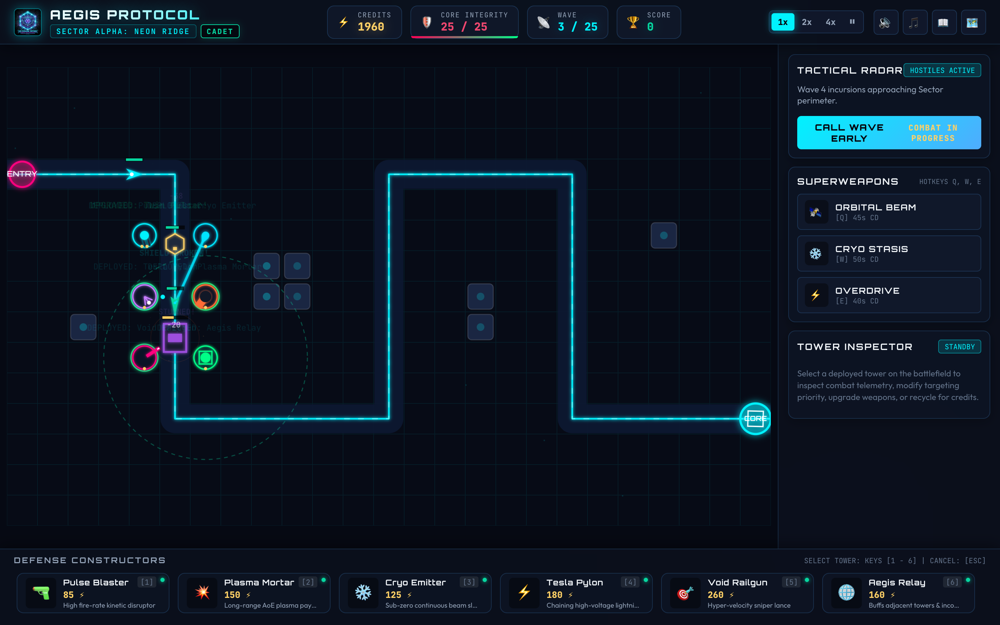
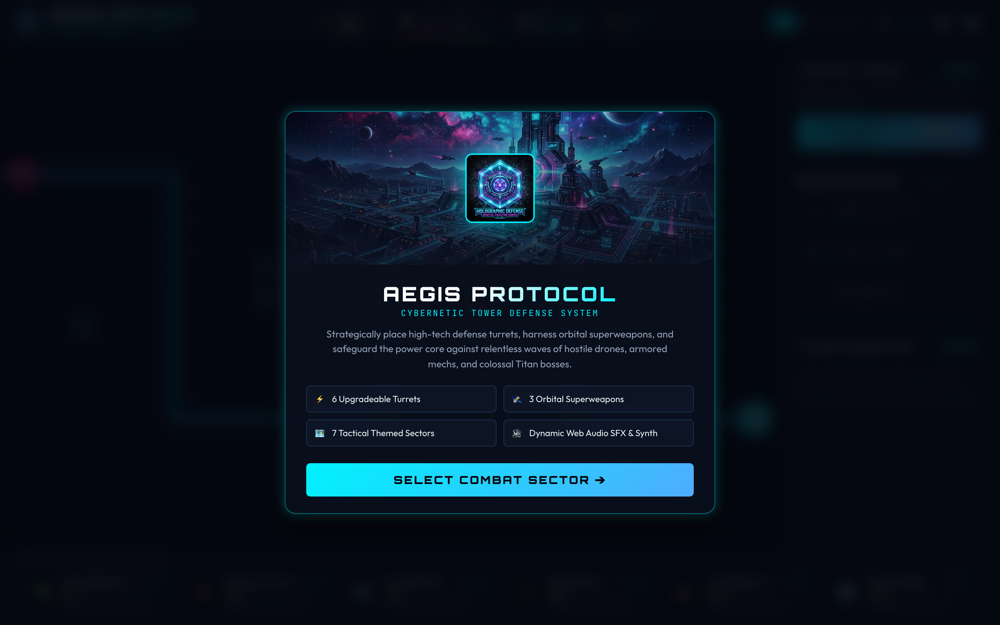
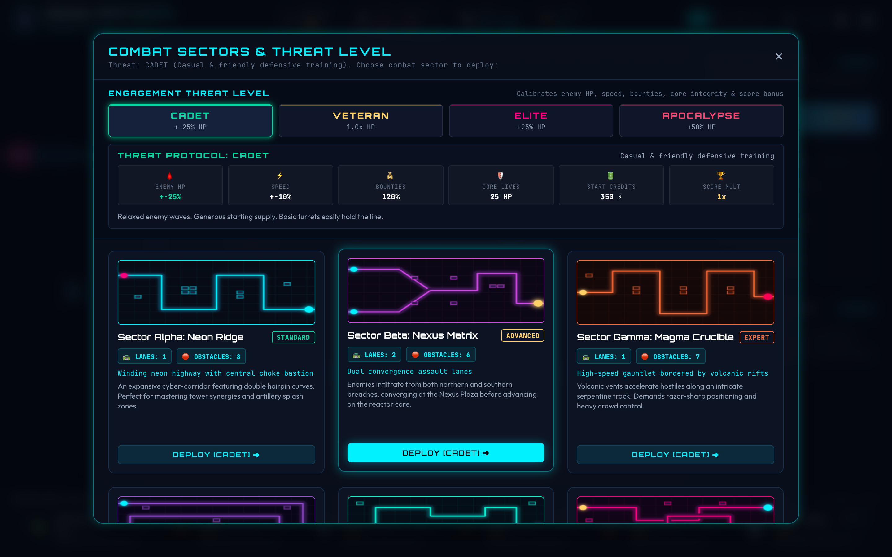
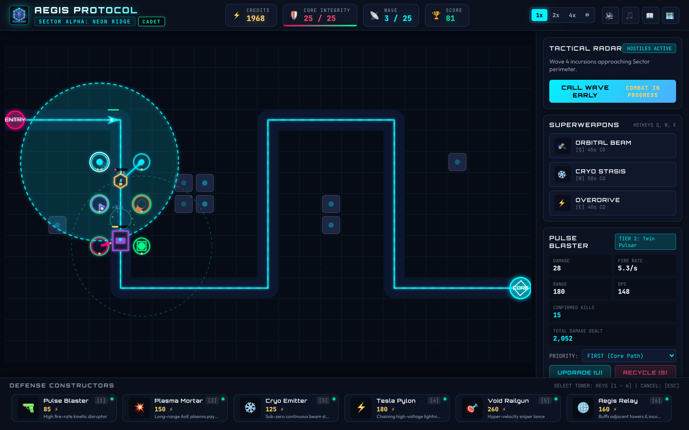
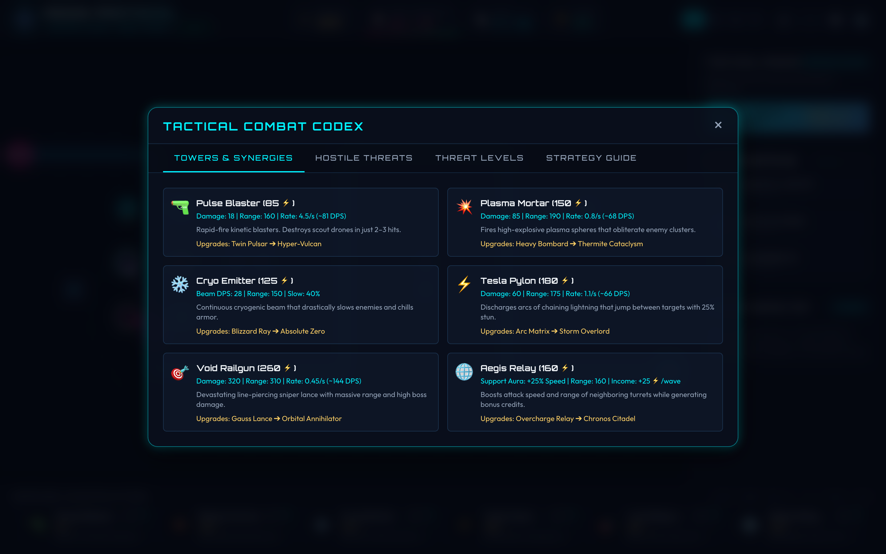
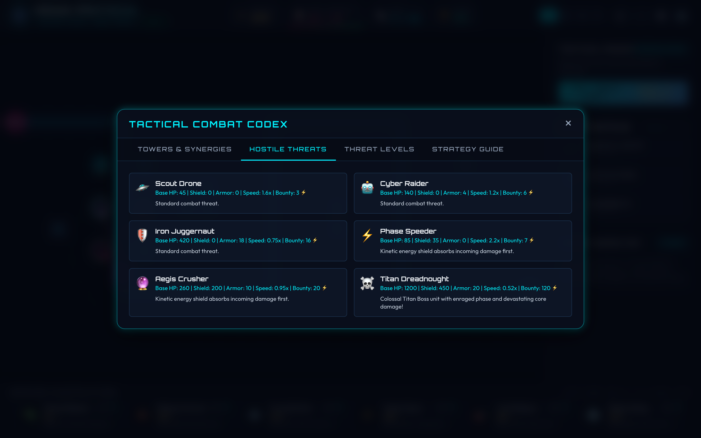

# ⚡ Cybernetic TD: Aegis Protocol

[](https://vitejs.dev/)
[](https://developer.mozilla.org/en-US/docs/Web/API/Canvas_API)
[](https://developer.mozilla.org/en-US/docs/Web/API/Web_Audio_API)
[](LICENSE)

An adrenaline-fueled, sci-fi cybernetic tower defense strategy game built entirely with modern Vanilla JavaScript and HTML5 Canvas. Deploy high-tech defense turrets, harness orbital superweapons, and safeguard the planetary reactor core against relentless waves of hostile drones, heavy armored mechs, and colossal Titan Dreadnought bosses.

---



---

## 🎮 Game Highlights

- **Dynamic Cyberpunk Aesthetics**: Sleek neon aesthetic with particle shockwaves, real-time laser beams, freeze mist, lightning chains, floating combat text, and reactive screen shake.
- **7 Tactical Combat Sectors**: Navigate unique lane layouts, convergence choke points, hairpin bends, and environmental obstacles across 7 distinct sectors.
- **4 Calibrated Threat Levels**: Select between **Cadet**, **Veteran**, **Elite**, and **Apocalypse** to tailor enemy vitality, movement velocities, credit bounties, and core integrity.
- **6 Specialized Defensive Turrets**: Build and customize Pulse Blasters, Plasma Mortars, Cryo Emitters, Tesla Pylons, Void Railguns, and Aegis Support Relays.
- **Multi-Tier Upgrade Progression**: Every turret features unique 3-tier upgrade paths with specialized mechanics (armor penetration, freezing chains, critical strikes, and economic bonuses).
- **3 Commander Superweapons**: Call in real-time game-changers including the **Orbital Beam Strike**, **Cryo Stasis Field**, and **Reactor Overdrive**.
- **Tactical Combat Codex**: Built-in interactive database documenting all turret archetypes, enemy vulnerabilities, threat level modifiers, and combat tips.
- **Procedural Synthesizer Audio**: Powered by the Web Audio API with punchy synth SFX, laser pulses, explosive thuds, and dynamic background synthwave music.

---

## 📸 In-Game Showcase

### 1. Command Terminal & Initialization
Launch directly into the high-tech mission briefing terminal to inspect system parameters and initialize defensive protocols.



---

### 2. Combat Sectors & Threat Protocol Selection
Choose your battleground and calibrate the tactical threat level before deploying into the sector. Live stat chips illustrate HP, speed, and credit multipliers in real time.



---

### 3. Active Battlefield Combat
Establish crossfire killzones and watch defense turrets unleash devastating volleys against encroaching hostile swarms.


---

### 4. Real-Time Tower Inspection & Upgrade Deck
Click any turret to inspect combat telemetry: confirmed kills, total damage dealt, real-time DPS, targeting priority modes (First, Last, Strongest, Weakest, Closest), and upgrade branches.



---

### 5. Tactical Combat Codex: Turret Arsenal
Review comprehensive weapon specifications, firing cadences, and tier progressions for your defensive arsenal.



---

### 6. Hostile Threats & Boss Intel Database
Study hostile drone archetypes, kinetic shield ratings, armor plating values, and Titan boss battle mechanics.



---

## 🗺️ Combat Sectors

| Sector | Difficulty | Lanes | Obstacles | Tactical Description |
| :--- | :---: | :---: | :---: | :--- |
| **Sector Alpha: Neon Ridge** | Standard | 1 | 8 | Winding cyber-highway with double hairpin turns and central choke bastion. |
| **Sector Beta: Nexus Matrix** | Advanced | 2 | 6 | Dual-convergence assault lanes converging at the central reactor plaza. |
| **Sector Gamma: Magma Crucible** | Expert | 1 | 7 | High-speed gauntlet bordered by volcanic rifts demanding razor-sharp positioning. |
| **Sector Delta: Vortex Abyss** | Tactical | 2 | 8 | Spiral vortex layout pulling hostiles around the perimeter before plunging inward. |
| **Sector Epsilon: Glitch Sanctum** | Elite | 1 | 9 | Zig-zagging electromagnetic corridor flanked by unstable quantum nodes. |
| **Sector Zeta: Circuit Core** | Master | 2 | 6 | Microchip architecture with dual parallel assault highways. |
| **Sector Omega: Void Singularity** | Nightmare | 3 | 10 | Triple-breach frontline converge on a hyper-dense central reactor nexus. |

---

## 🎯 Threat Levels (Difficulty Tiers)

| Threat Level | Enemy HP | Movement Speed | Bounty Rewards | Starting Supply | Core Lives | Description |
| :--- | :---: | :---: | :---: | :---: | :---: | :--- |
| **CADET** | 0.75x | 0.90x | 120% | 350 ⚡ | 25 HP | Accessible onboarding; 1 Pulse Blaster easily clears Wave 1. |
| **VETERAN** | 1.00x | 1.00x | 100% | 260 ⚡ | 20 HP | Standard balanced experience rewarding steady upgrades. |
| **ELITE** | 1.25x | 1.05x | 90% | 220 ⚡ | 15 HP | Demanding incursions requiring heavy crowd control and beam slows. |
| **APOCALYPSE** | 1.50x | 1.10x | 80% | 180 ⚡ | 12 HP | Brutal onslaught requiring max-tier synergies and superweapon timing. |

---

## 🛡️ Defensive Turrets

| Turret | Icon | Cost | Role | Specialization |
| :--- | :---: | :---: | :--- | :--- |
| **Pulse Blaster** | 🔫 | 85 ⚡ | Rapid Kinetic | High fire rate (4.5/s, 81 DPS); shred early scouts in 2 hits. |
| **Plasma Mortar** | 💥 | 150 ⚡ | Long-Range Artillery | Heavy AoE splash damage (85 dmg, 70px blast radius). |
| **Cryo Emitter** | ❄️ | 125 ⚡ | Crowd Control | Continuous cryogenic beam dealing 28 DPS and slowing by 40%. |
| **Tesla Pylon** | ⚡ | 180 ⚡ | Area Chain | High-voltage electric arcs chaining to 3 targets with 25% stun chance. |
| **Void Railgun** | 🎯 | 260 ⚡ | Anti-Armor Sniper | Piercing hyper-velocity lance (320 dmg, 310 range, 1.75x boss bonus). |
| **Aegis Relay** | 🌐 | 160 ⚡ | Tactical Support | +25% attack speed aura to adjacent turrets + 25 ⚡ bonus income per wave. |

---

## 🚀 Commander Superweapons

- **Orbital Beam Strike [Key: Q]** (45s CD): Target any coordinate on the grid to drop a celestial particle beam dealing massive localized devastation.
- **Cryo Stasis Field [Key: W]** (50s CD): Flash-freezes all active enemies across the entire sector for 4 seconds.
- **Reactor Overdrive [Key: E]** (40s CD): Supercharges all deployed turrets with +75% fire rate and +25% bonus damage for 8 seconds.

---

## ⌨️ Controls & Shortcuts

| Action | Hotkey / Input |
| :--- | :--- |
| **Select Turret [1 - 6]** | Keys `1` through `6` |
| **Multi-Placement** | Hold `Shift` while clicking to place multiple turrets |
| **Cancel Placement / Deselect** | `Escape` or Right-Click |
| **Superweapons** | `Q` (Orbital Beam), `W` (Cryo Stasis), `E` (Overdrive) |
| **Upgrade Selected Tower** | `U` |
| **Recycle / Sell Selected Tower** | `S` |
| **Cycle Targeting Priority** | Click Priority dropdown in Inspector (`First`, `Last`, `Strongest`, `Weakest`, `Closest`) |
| **Call Wave Early** | Click `CALL WAVE EARLY` for bonus credits |
| **Game Speed Toggle** | `1x`, `2x`, `4x` buttons in top HUD |
| **Pause / Resume** | `Spacebar` or Pause button |
| **Audio / BGM Toggle** | Audio & Music icons in top HUD |

---

## 🛠️ Tech Stack & Architecture

- **Engine Core**: HTML5 `<canvas>` 2D context running high-performance game loop at 60 FPS.
- **Framework & Bundler**: [Vite](https://vitejs.dev/) with ECMAScript Modules (ESM).
- **Sound Engine**: Native Web Audio API synthesizing square/sawtooth oscillators, white noise bursts, and frequency filters.
- **Visual FX**: Custom particle system handling explosions, shockwaves, laser beams, floating combat text, and screen shake.
- **CSS Styling**: Vanilla modern CSS featuring glassmorphism, responsive grid layouts, and custom scrollbars.

---

## 🚀 Getting Started

### Prerequisites
- [Node.js](https://nodejs.org/) (version 18+ recommended)
- `npm` or `yarn`

### Installation & Launch

1. **Clone the repository**:
   ```bash
   git clone git@github.com:Rahul-Bansal-255/Cybernetic_TD.git
   cd Cybernetic_TD
   ```

2. **Install dependencies**:
   ```bash
   npm install
   ```

3. **Start the development server**:
   ```bash
   npm run dev
   ```
   Open your browser and navigate to `http://localhost:5173/` (or the port specified by Vite).

4. **Build for production**:
   ```bash
   npm run build
   ```
   Production-ready static assets will be compiled into the `dist/` directory.

5. **Regenerate In-Game Screenshots**:
   ```bash
   node scripts/capture_screenshots.js
   ```

---

## 📄 License

This project is licensed under the [MIT License](LICENSE).
